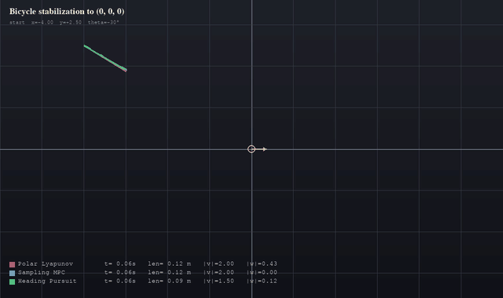
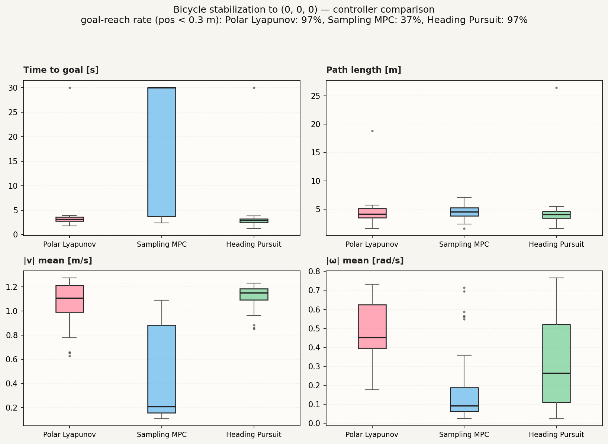

# Bicycle stabilization to (0, 0, 0)



Стабилизация кинематической модели велосипеда в точке (x, y, θ) = (0, 0, 0)
из произвольного стартового положения. Три разных контроллера, бенчмарк
со статистикой и pygame-анимация.



## Модель

Кинематический велосипед, состояние `q = [x, y, θ]`, управление
`u = [v, δ]` (скорость, угол поворота переднего колеса):

    ẋ = v · cos θ
    ẏ = v · sin θ
    θ̇ = v / L · tan δ

Параметры по умолчанию: `L = 1 м`, `|v| ≤ 2 м/с`, `|δ| ≤ 35°`,
разрешён задний ход. Интегратор — RK4, шаг 20 мс.

## Контроллеры

| Имя | Идея | Файл |
|---|---|---|
| **Polar Lyapunov** | Замкнутый закон в полярных координатах (Corke 4.16): `v = k_ρ·ρ`, `ω = k_α·α + k_β·β`. Кривизна `κ = ω/v` остаётся конечной у цели, что фиксирует финальный угол. | `bike/controllers/polar_lyapunov.py` |
| **Sampling MPC** | На каждом шаге перебираем сетку `(v, δ)` (11 × 11, неравномерная по `v`), катим вперёд на 20 шагов и берём минимум стоимости `J = w·||pos||² + w·θ² + w·путь + w·u²`. Векторизованно через NumPy. | `bike/controllers/sampling_mpc.py` |
| **Heading Pursuit** | Простой baseline: ориентируется на цель пропорционально ошибке курса, едет вперёд (или назад если цель сзади). **Не корректирует финальный θ** — упирается в цель «как попало». | `bike/controllers/heading_pursuit.py` |

> 💡 Теорема Брокетта: для неголономной системы нет гладкой
> времянезависимой обратной связи, стабилизирующей все стартовые позы.
> Поэтому 100% сходимость к (0,0,0) одним непрерывным законом невозможна.
> Polar Lyapunov сходится почти везде по позиции; финальный угол
> подбирается «в последний момент» за счёт ненулевой кривизны.

## Структура

```
bike_stabilization/
├── bike/
│   ├── model.py              ← кинематика + RK4
│   ├── simulator.py          ← Episode, метрики
│   └── controllers/
│       ├── base.py
│       ├── polar_lyapunov.py
│       ├── sampling_mpc.py
│       └── heading_pursuit.py
├── benchmark.py              ← N случайных стартов, сохраняет JSON
├── plot_boxplots.py          ← рисует results/boxplots.png
├── main.py                   ← pygame-анимация
├── results/
│   ├── benchmark.json
│   └── boxplots.png
└── requirements.txt
```

## Запуск

```bash
pip install -r requirements.txt

# 1) бенчмарк на 40 случайных стартах
python benchmark.py --n 40 --seed 42

# 2) графики ящик-с-усами
python plot_boxplots.py

# 3) анимация
python main.py
```

### Управление в анимации

| Клавиша | Действие |
|---|---|
| `SPACE` | случайный новый старт |
| `R` | сброс с тем же стартом |
| `1` / `2` / `3` | пресет-старты |
| `TAB` | пауза |
| `+` / `-` | скорость симуляции |
| `Q` / `Esc` | выход |

Три велосипеда (по числу контроллеров) стартуют одновременно и параллельно
едут к цели — видна разница в траекториях, скоростях, и в том, кто
доехал, а кто застрял.

## Метрики

`benchmark.py` сохраняет в JSON для каждого старта: успех (позиция ближе
0.3 м), время достижения, длина пути, средняя |v|, средняя |ω|, финальная
ошибка позиции и финальная ошибка угла.

`plot_boxplots.py` рисует 4 ящика с усами:
- **Time to goal [s]** — время до входа в радиус 0.3 м у цели
- **Path length [m]** — длина траектории
- **|v| mean [m/s]** — средняя |линейная скорость|
- **|ω| mean [rad/s]** — средняя |угловая скорость| (активность руления)

Что видно из текущего бенчмарка (40 стартов, seed 42):

- **Polar Lyapunov**: ~97% доезжают, быстро (~3 с медиана), умеренная
  длина пути, **высокая угловая скорость** — он активно крутит руль,
  чтобы дотянуть финальный угол.
- **Heading Pursuit**: тоже ~97% доезжают по позиции, но **|ω| ниже** —
  он не пытается фиксировать θ; глянь на финальную ошибку угла в JSON,
  она большая.
- **Sampling MPC**: ~37% доезжают, **широкий разброс по времени** (часто
  «зависает» на горизонте оптимизации), **самая низкая |v|** — осторожный.

Финальные углы — в `results/benchmark.json` (поле `final_head_err`).

## Возможные расширения

- Динамическая модель велосипеда (с инерцией, проскальзыванием шин)
- Reeds-Shepp планировщик пути + трекер
- Истинный iLQR/SQP-MPC вместо сэмплинга
- Препятствия и обход
